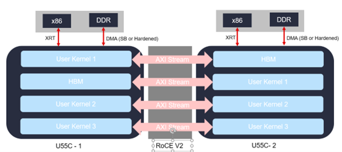
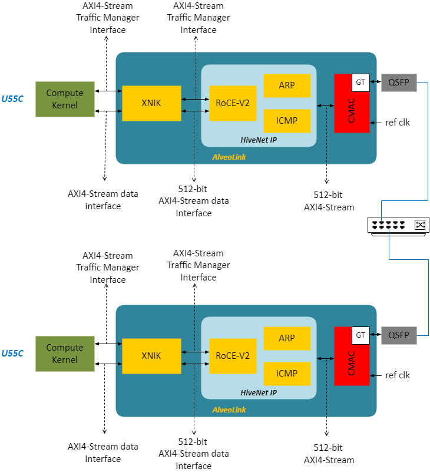

<!---
/*
 * Copyright 2019-2022 Xilinx, Inc.
 *
 * Licensed under the Apache License, Version 2.0 (the "License");
 * you may not use this file except in compliance with the License.
 * You may obtain a copy of the License at
 *
 *     http://www.apache.org/licenses/LICENSE-2.0
 *
 * Unless required by applicable law or agreed to in writing, software
 * distributed under the License is distributed on an "AS IS" BASIS,
 * WITHOUT WARRANTIES OR CONDITIONS OF ANY KIND, either express or implied.
 * See the License for the specific language governing permissions and
 * limitations under the License.
*/
--->
# AlveoLink

This repository contains IPs, Vitis kernels and software APIs that can be leveraged by Vitis users to build scale-out solutions on multiple Alveo cards. A set of example designs are also provided to demonstrate the usage of these components.

## Introduction

For most applications being run in the data centres today, one x86 server (also called a node) is not enough to handle either the size of the data or the size of the computation or both. Several x86 servers networked efficiently are employed to run a distributed computation for an application. To be able to accelerate such applications using Alveo cards, multiple cards per server and multiple such servers networked are needed. The Alveo cards need to communicate to one another to complete computation in such a setup. For a Vitis kernel running on an Alveo card, using the x86 server network requires going over PCIE to the attached x86 CPU and then over network to a remote x86 server and then over PCIE to a remote Alveo card. This makes Vitis kernel to Vitis kernel communication very slow and hence overall acceleration by Alveo cards to be not attractive. We need a direct Alveo-2-Alveo network with very low latency to be able to provide attractive performance acceleration over competition.

The main goal of a Alveo-2-Alveo communication network IP is to allow a Vitis kernel on one Alveo card to talk to a remote Vitis kernel on another Alveo card with minimum possible latency and minimum to no changes in Vitis programming paradigm. The diagram below depicts the idea:

Having this ability will allow us to map any large size compute that would otherwise not fit on one Alveo to a cluster of Alveo cards. Also, this will allow us to handle any large size data as we can pool multiple cards to create enough data caching capacity.

## Network components

The diagram below depicts the intended usage of Network components for scaling out compute applications across compute kernels on multiple Alveo cards connected to one another using an Ethernet switch. 

The HiveNet IP + CMAC IP + XNIK kernel from AMD consist of “AlveoLink Subsystem”.  Following are main goals of our AlveoLink subsystem:

* Provide lossless and in-order data transfer over CMAC IP and conventional network switches
* Provide AXI-4 stream interfaces for data transfer, Vitis kernel synchronization and data caching
* Provide software APIs for configurations and examining the network IPs

The XNIK kernel is responsible for synchronizing the Vitis kernels and caching the data for the Vitis compute kernels.

## Repository structure

~~~
├── network
│   └── roce_v2
├── kernel
├── examples
|   └── network 
└── img
~~~

* network: this folder contains the 100Gb/s networking IPs. The roce_v2 subfolder contains the lossless communication support, that is HiveNet IP built on roce_v2 protocal and CMAC IP.
* kernel: this folder contains the Xilinx Network Interface Kernels (XNIK) for synchronization control and data caching support. 
---
**NOTE**

XNIK code and examples will be included soon. Stay tunned.

---
* examples: this folder contains Vitis example designs built on top of network and kernel components.
* img: this folder contains images.

