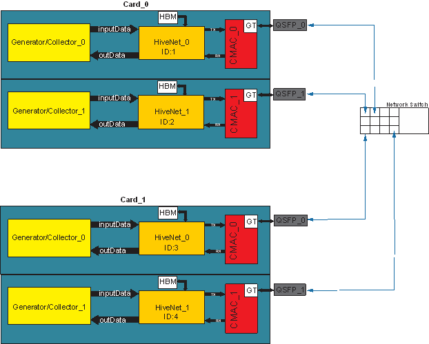

# HiveNet Usage Example 

This example illustrates how to use HiveNet IP in an Vitis design. The diagram below shows the system implemented in this example design.



This example design is realized on 2 Alveo U55C cards. Each card has 2 QSFP ports, in total 4 QSFP ports, which are connected to a commericial ethernet switch. 4 CUs (Compute Units) of Vitis HLS kernel generator_collector are connected to their corresponding QSFP ports via HiveNet IPs and CMAC IPs. These 4 CUs communication with each other via Ethernet. The host code controls the communication patterns. For example, which CU sends packets, which CU receives packets and the number of packets being tranmitted etc. 

## Design details

### generator_collector kernel

The generator_collector kernel is writtn in Vitis HLS and can be controlled by host code as either a package generator or a package collector. That is, it can run in a generator mode or a collector mode.

#### Generator mode

In this mode the kernel generates packets, and sends them to the HiveNet IP. Then the HiveNet IP sends the data to the other card over the network with appropriate ID specified in the settings. The destination ID is configured by the host code.

The data is generated in the following way:
Value_byte_0 = 0 ^ (the_id_of_the_attached_HiveNetIP ^ ID_of_the_current_packet)
Value_byte_1 = 1 ^ (the_id_of_the_attached_HiveNetIP ^ ID_of_the_current_packet)
…
Value_byte_i = (i ^ (the_id_of_the_attached_HiveNetIP ^ ID_of_the_current_packet)
The number of packets that should be generated is passed to the kernel using an argument the maximum value of which can be: 4294967295(232-1).


#### Collector mode

In this mode the kernel receives the packets and checks for errors inside them. Then it outputs the number of received packets and indicates whether there is an error in the data. 

### Host application

The host application expects both cards to be installed on the same host machine.
1. First it configures all the HiveNets IPs:
    * IP subnet 192.168.0.0/13
    * MAC subnet 34:78:44:33:2*:**/13
    * Set the IDs of the HiveNet IPs on card 0 with (0, 1), and the IDs of HiveNet IPs on card 1 with (2, 3).

2. Configures CMACs by enabling RS-FEC and waiting for link to be up from the switch side.
3. Set the CUs of the generaor_collector kernel on one card as collectors and kick off the CUs.
4. Set the CUs of the generaor_collector kernel on the other card as generator and kick off the CUs.
5. Starts transmission between two pairs of generator collector CUs and wait until all packets are transmitted
6. Checks weather there is any error happened in the packets transmitted.


## Build and run the design

This example design assume end users have two Alveo U55C cards installed on the same host machine. To run this design on your local machine, the end users needs to follow the steps below.

* Set up Vitis environment
* Build .xclbin 
* Build host executable
* Running the design


### 1. Set up Vitis environment

To build and run this example design, users need to install xilinx_u55c_gen3x16_xdma_3_202210_1 shell, Vitis 2022.1 and XRT 2022.1 on their local machines. 

After the installation, users need to set up Vitis 2022.1 environment variables and the environment variable AL_PATH to point to the AlveoLink repository location. The following commands are normally used to set up those environment variables on an Linux machine. Users need to adjust the path to their local Vitis installation path and the AlveoLink repository path.

```sh
source /opt/xilinx/Vitis/settings64.sh
source /opt/xilinx/xrt/setup.sh
export AL_PATH=/opt/xilinx/apps/AlveoLink
```

### 2. Build .xclbin file for Alveo U55C card

```sh
navigate to examples/network/roce_v2/generator_collector

make xclbin TARGET=hw DEVICE=/opt/xilinx/platforms/xilinx_u55c_gen3x16_xdma_3_202210_1/xilinx_u55c_gen3x16_xdma_3_202210_1.xpfm INTERFACE=3

```

### 3. Build host executable

```sh
navigate to examples/network/roce_v2/generator_collector

make clean TARGET=hw
make host TARGET=hw
```

### 4. Running the design

```sh
navigate to examples/network/roce_v2/generator_collector

change "your_hostname" in the following command to your host machine name

./build_dir.hw.xilinx_u55c_gen3x16_xdma_3_202210_1/your_hostname/HiveNet_test.exe -x build_dir.hw.xilinx_u55c_gen3x16_xdma_3_202210_1/your_hostname/hiveNetTest.xclbin -s 0 -c 53
```

#### Allowed options:
  * -h, --help                          produce help message
  * -d, --dev_1 arg (=0)                Device 1 index 
  * -k, --dev_2 arg (=1)                Device 2 index
  * -x, --xclbin arg (=binary_container_1.xclbin)
  * -s, --sender_id arg (=1)            sender device id
  * -c, --cnt arg (=32)                 packet count
