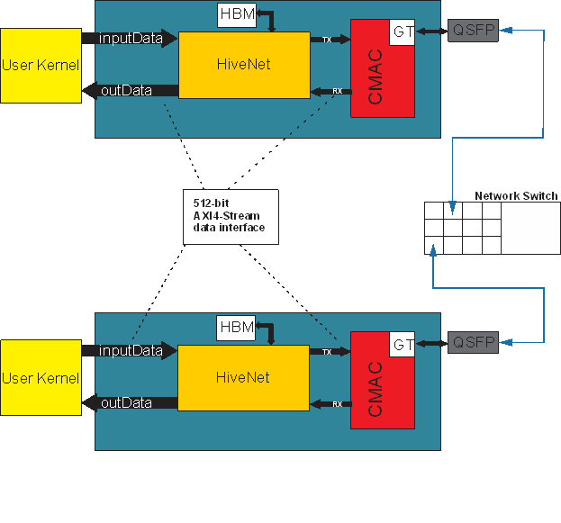

# HiveNet IP

HiveNet IP provides low latency, high bandwidth and lossless transmission over the commodity network. It contains roce_v2 protocal implementation and allows Vitis kernels to communication over Ethernet via AXI-4 streams. 

## Key features

* Lossless connection between 2 or more kernels with or without Ethernet switch.
* Up to 8192 lossless flows (connections) for each card / IP. Round-trip data transfer latency between two user kernels is 1us.
* Line rate bandwidth for packet sizes >= 128B
* ~5% resource usage of Alveo U55C card

## Interfaces

The diagram below shows the interfaces of HiveNet.

 

* inputData (AXI4-Stream)

| Signal name  | I/O    | Description |
|--------------|--------|-------------|
| tvailid      | input  | AXIS valid |
| tready       | output | AXIS rdy   |
| tdata[511:0] | input  | AXIS data bus |
| tdest[12:0]  | input  | Remote HiveNet ID where data needs to be sent(up to 8192) |
| tlast        | input  | AXIS last signal (max 1024 bytes) |

* outData (AXI4-Stream)

| Signal name  | I/O    | Description |
|--------------|--------|-------------|
| tvailid      | output | AXIS valid |
| tready       | input  | AXIS rdy   |
| tdata[511:0] | output | AXIS data bus |
| tdest[12:0]  | output | Remote HiveNet ID where data was received(up to 8192) |
| tlast        | output | AXIS last signal (max 1024 bytes) |

* HBM_read (AXI4 read only)
* HBM_write(AXI4 write only)
* S_AXI_0 (AXI4-Light)
* tx(AXI4-Stream connected to CMAC)
* rx(AXI4-Stream connected to CMAC)

## Software APIs

The software APIs declared in [HiveNet.hpp](sw/include/HiveNet.hpp) allow Vitis users to control HiveNet in the host cdoe. 

